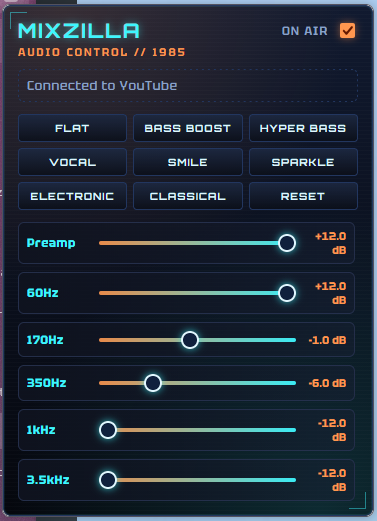

# mixzilla

A retro-futuristic 1985-styled Firefox extension for live 5-band Equalizer control on YouTube and YouTube Music.

## Features
- **Real-time 5-Band EQ**: Adjust 60Hz, 170Hz, 350Hz, 1kHz, and 3.5kHz.
- **Preamp Control**: Prevent clipping or boost quiet tracks.
- **9 Presets**: Flat, Bass Boost, Hyper Bass, Vocal, Smile, Sparkle, Electronic, Classical, and Reset.
- **Persistent Settings**: Auto-saves and reapplies settings on reload/navigation.
- **Cyberpunk UI**: Neon accents, scanlines, and tactile controls.

## Development Setup
1. Go to `about:debugging#/runtime/this-firefox` in Firefox.
2. Click **Load Temporary Add-on...**
3. Select `manifest.json`.
4. Pin to toolbar and open YouTube.
